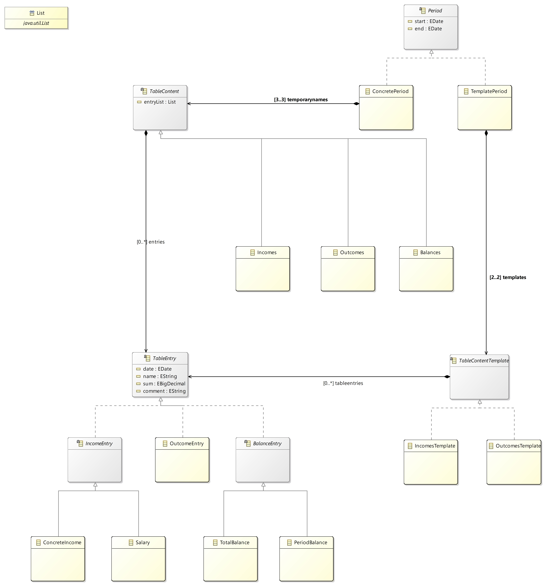

# MyFinances-App
Financial accounting application based on Eclipse RCP.

# Run from IDE

## Import to workspace
1. Run in command line: git clone https://github.com/elarina/MyFinance-App.git MyFinances-App
2. Open Eclipse IDE for RCP and RAP Developers.
3. File -> Import -> Existing Projects into Workspace -> Next
4. Select root directory: MyFinances-App
5. Finish.

## Run configurations
1. Run -> Run Configurations
2. Eclipse Application -> New launch configuration
3. In "Program to Run" choose "Run a Product" with the value "my.finances.app.product"
4. Go to Plug-ins tab
5. In "Launch with" choose "plug-ins selected below only"
6. Deselect All
7. Add Required Plug-ins
8. Apply
9. Run

# Build with maven and Run executable
## Build
1. Open command line
2. Go to project root
3. Type "mvn clean verify"

## Run
After successfull build with maven:
1. Go to my.finances.app\target\products\finances
2. Go to folder which corresponding to your OS
4. Find MyFinance.exe and run it.

# Application Architecture Design
See /design/my.finances.app.uml.components/model/components.ecore uml diagrams

Elipse Modeling Framework should be installed into IDE for viewing diagrams.

## Install EMF to IDE
1. Help -> Install New Software...
2. In "Work with" field type http://download.eclipse.org/releases/latest
3. Find in list and expand "Modeling"
4. Check "EMF - Eclipse Modeling Framework SDK" and the "Ecore Diagram Editor (SDK)"
5. Install it.

## Class diagram example
### my.finances.app.core.month old class diagram:

### my.finances.app.core.month new class diagram:

# User Interface Design
See /design/my.finances.app.design.ui/

WireframeSketcher should be installed into IDE for viewing UI-sketchs.

## Install WireframeSketcher
1. Help -> Install New Software...
2. In "Work with" field type https://wireframesketcher.com/updates
3. Check all in list.
4. Install it.

## UI design examples
Summary UI-perspective:

